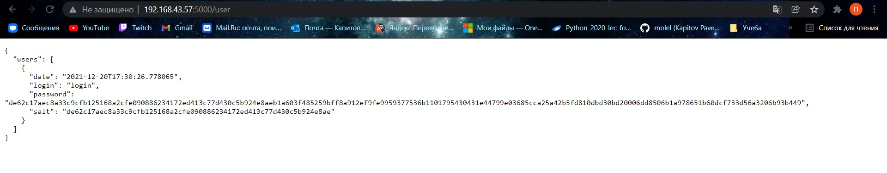

# Создание микросервиса

## Задания для выполнения

1.На основе предложенного шаблона реализуйте сервис, реализующий регистрацию пользователей. Сервис должен поддерживать
REST API и коллекцию /user/, хранящую данные о логинах и паролях пользователей, зарегистрированных в системе. Сервис
должен принимать и отдавать информацию в формате JSON. Сервис должен хранить следующую информацию про каждого
пользователя: логин, хеш пароля (лучше с солью), дату регистрации.

Успешная регистрация пользователя:

Попытка регистрации уже существующего пользователя:

Успешный вход в систему:

Попытка входа в систему по несуществующему логину:

Попытка входа в систему по неправильному паролю:

Хранение пароля в хешированном виде:

2.Настройте веб-сервер по Вашему выбору (Apache2 или nginx) таким образом, чтобы он поддерживал соединение по протоколу
HTTPS. Для этого сгенирируйте самоподписанный сертификат SSL.

3.Модифицируйте код вашего сервиса таким образом, чтобы он поддерживал защищенное соединение.

